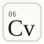
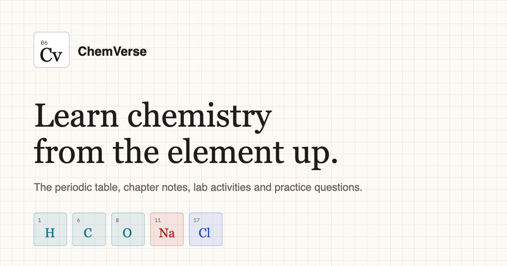

<div align="center">



# ChemVerse

### Learn chemistry from the element up.

A free, beautifully simple study reference: the full periodic table, NCERT notes for Classes 9 to 12, AP Chemistry lessons, 16 interactive labs and a study assistant that only answers from verified notes.

[**Live site**](https://chemverse-mangal9.vercel.app) · [**Periodic table**](https://chemverse-mangal9.vercel.app/explore) · [**Take a quiz**](https://chemverse-mangal9.vercel.app/quiz)


<br />



</div>

<br />

## Why ChemVerse?

Chemistry is easier when everything lives in one calm, fast place. ChemVerse brings your syllabus notes, a searchable periodic table, hands-on simulations and practice questions together, so you can go from "what is an atom?" to balancing equations without opening ten tabs.

## What's inside

| | Feature | What you get |
|---|---|---|
| :atom: | **Periodic table** | All 118 elements with detail pages, categories, properties and trends |
| :books: | **NCERT notes, Classes 9 to 12** | Chapter-by-chapter notes, diagrams and worked examples |
| :mortar_board: | **AP Chemistry** | 33 lessons from atomic structure to thermodynamics |
| :test_tube: | **Interactive lab** | 16 simulations and calculators, from titration to Lewis structures |
| :brain: | **Quizzes** | Practice questions to test yourself as you go |
| :speech_balloon: | **Study assistant** | Ask a question and get an answer grounded only in this site's notes |
| :mag: | **Global search** | Jump to any element, chapter, lesson or lab instantly |
| :crescent_moon: | **Light and dark themes** | Comfortable reading, day or night |

## Curriculum coverage

| Level | Content |
|---|---|
| **Class 9** | 4 NCERT chapters |
| **Class 10** | 4 NCERT chapters, with a read-aloud notes player |
| **Class 11** | 13 NCERT chapters |
| **Class 12** | 10 NCERT chapters |
| **AP Chemistry** | 33 lessons |

## The lab

Hands-on tools you can use right in the browser:

- **Reaction bench** · mix reagents and see what happens
- **Acid-base titration** · watch the curve and the endpoint
- **Gas law simulator** · pressure, volume and temperature
- **Reaction rate simulator** · explore what speeds a reaction up
- **Electron configuration builder** · fill orbitals step by step
- **pH, dilution and molar mass calculators**
- **Gibbs free energy calculator**
- **Flame test lab**, **calorimetry lab** and **electrochemistry lab**
- **Equation balancer** · balance any reaction
- **Lewis structure builder** and **molecular geometry explorer**
- **Periodic trend sorter**

## A study assistant you can trust

On a study site, a confident wrong answer is worse than no answer. The ChemVerse assistant is built around that idea:

- It answers **only** from passages retrieved from the site's own notes, and says so plainly when the notes do not cover a question.
- Many questions are answered **verbatim from the notes**, instantly, with no model call at all.
- Off-topic requests are politely refused, so it cannot be used as a general chatbot.
- Your API key stays on the server and is never sent to the browser.

## Tech stack

| Layer | Tools |
|---|---|
| **Frontend** | React 18, TypeScript, Vite, React Router |
| **Styling** | Tailwind CSS, shadcn/ui, Radix UI, lucide icons |
| **Assistant** | Gemini via a Vercel Edge Function (`api/chat.ts`) |
| **Hosting** | Vercel, with automatic deploys on every push to `main` |

## Getting started

You need [Node.js](https://nodejs.org) 18 or newer.

```sh
# 1. Install dependencies
npm install

# 2. Add your Gemini key for the study assistant
cp .env.example .env

# 3. Start the dev server
npm run dev
```

The site runs at `http://localhost:8080`. The assistant needs a `GEMINI_API_KEY` in `.env`; everything else works without one.

### Scripts

| Command | What it does |
|---|---|
| `npm run dev` | Start the development server |
| `npm run build` | Create a production build in `dist/` |
| `npm run preview` | Preview the production build locally |
| `npm run lint` | Lint the codebase |
| `npm test` | Run the test suite |

## Deploying to Vercel

1. Import the repository in Vercel (framework preset: **Vite**).
2. Add the environment variable `GEMINI_API_KEY`. Optionally add `GEMINI_MODEL`, and `SITE_URL` (for example `https://your-domain.com`) to generate a sitemap at build time.
3. Deploy. [`vercel.json`](vercel.json) handles single-page-app routing.

## Project structure

```
chemverse/
├── api/                 Edge function for the study assistant
├── public/              Icons, social preview image, robots.txt
├── scripts/             Sitemap generator and assistant test scripts
└── src/
    ├── components/      UI, labs, periodic table, quiz, chat, layout
    ├── data/            Elements, chapters, lessons, reactions, experiments
    ├── lib/             Search index and the assistant's knowledge retrieval
    └── pages/           One file per route
```

## About the author

<table>
  <tr>
    <td>

**Abhyudh PS Solanki** created, designed and built ChemVerse.

[](https://abhyudhsolanki.in)
[](https://github.com/AbhyudhPSS)
[](https://www.linkedin.com/in/abhyudh-p-s-solanki-62443828a/)
[](mailto:abhyudhsolanki@gmail.com)

</td>
  </tr>
</table>

## Copyright

Copyright (c) 2026 **Abhyudh PS Solanki**. All Rights Reserved.

This repository and everything in it, including the source code, design, text and graphics, is proprietary. No part of it may be copied, reproduced, distributed, modified or used without prior written permission. See [LICENSE](LICENSE) for the full terms.

<div align="center">

<sub>Made with care by Abhyudh PS Solanki</sub>

</div>
